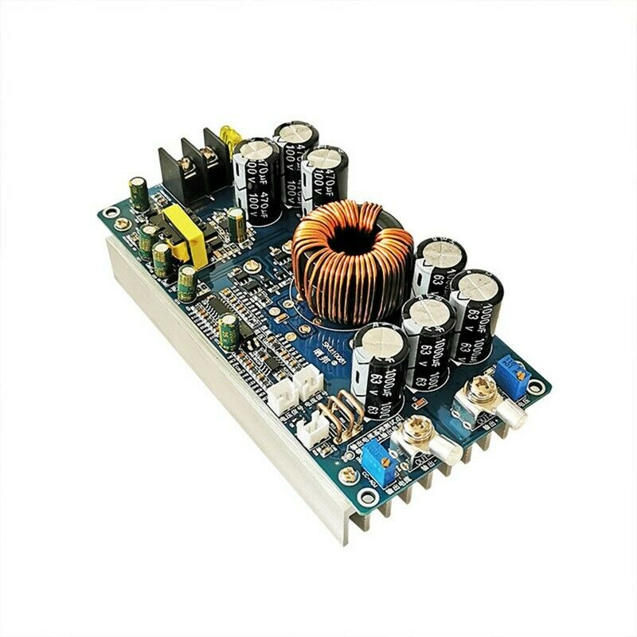

# Power Converter

These [800 watt 20A DC-DC converters](https://www.ebay.com/itm/114392846577) are cheap, durable, and effective. I use
one to convert my eBike battery down from 52 volts to 40 (or sometimes 24, 18, or 12) volts to power various tools.

Like many cheap chinese things off of eBay, they don't really have identifiable branding. Some are called "AP-D5830A",
but not all. There are likely many different factories producing the same reference design, hence some slight variation
in appearance. However, they're easily identifiable via the large inductor in the middle, as well as a big aluminum
heatsink on the back (with a small attached fan).

The only downside is that they don't come with a case or a voltage readout, which I aim to fix with this project.

Note that the code here is a bit of a mess. I wrote it before I had any idea what I was doing.

TODO:

-   [x] Make case prototype
-   [ ] Add voltmeters
-   [ ] Add holes for trim pots
-   [ ] Improve durability and weather resistance
